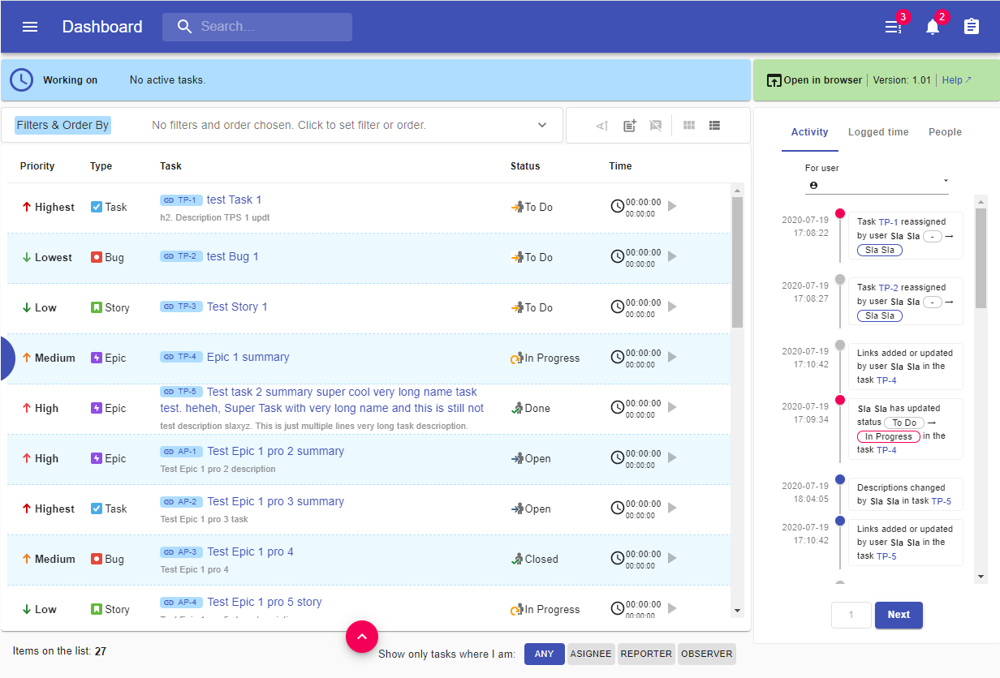
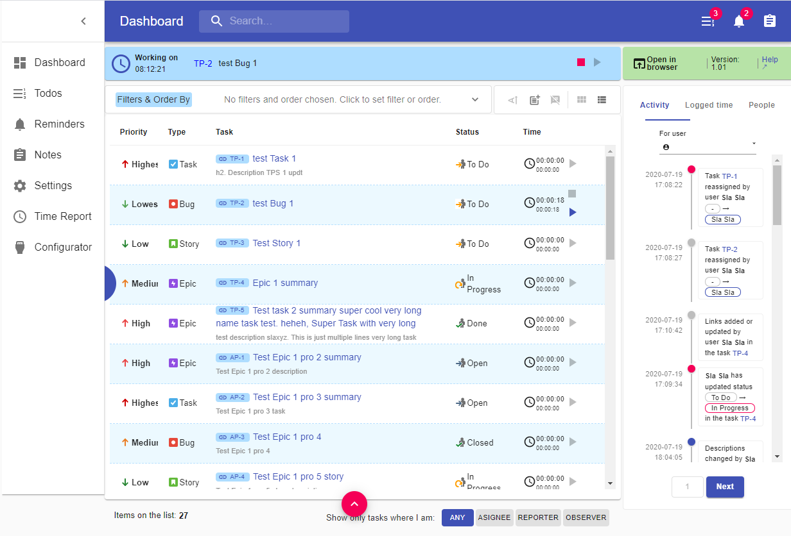

# Task manager addon

##### Chrome & Firefox Jira/Targetprocess/Taiga/Backlog add-on

This repository contains the code of Chrome & Firefox add-on for popular task managers such us Jira, Targetprocess, Taiga and Backlog.
The AddOn provides a few additional features such us timer, reminders, notes, todos and a few useful panels e.g. 
logged time component, people, last activity stream components and a few more.

------

------

------

## Current State of the project

**PROJECT IS IN PROGRESS.... 80% things done, 100% should be in 2, 3, max 4 weeks.**

First version of this AddOn is being developed for Chrome and for JIRA only. 
Other browsers and other task managers require additional adapters to be added later.

## A word about the code
Project is written in [ReactJS](https://reactjs.org/), [Typescript](https://www.typescriptlang.org/), 
uses [Redux Saga](https://github.com/redux-saga/redux-saga) and [Redux Toolkit](https://redux-toolkit.js.org/). 
Also, there are a few popular technical concepts used here, e.g.
[Atomic design](https://bradfrost.com/blog/post/atomic-web-design/), [Compound components](https://kentcdodds.com/blog/compound-components-with-react-hooks/), 
[HOCs](https://reactjs.org/docs/higher-order-components.html), [Render Props](https://reactjs.org/docs/render-props.html), 
[Context](https://reactjs.org/docs/context.html), [Hooks](https://reactjs.org/docs/hooks-custom.html) 
and also some tools like [Prettier](https://prettier.io/), [Husky](https://github.com/typicode/husky), [LintStaged](https://github.com/okonet/lint-staged).

## Credits

Project is bootstrapped with [React Boilerplate meets CRA](https://github.com/react-boilerplate/react-boilerplate-cra-template).
Project uses [JiraJS](https://github.com/mrrefactoring/jira.js/), [MaterialUI](https://material-ui.com/).
Thanks to anymore1405 for great project [Redux-toolkit-saga](https://github.com/anymore1405/redux-toolkit-saga#readme) and inspiration.
Thanks MrRefactoring for [jira.js](https://github.com/MrRefactoring/jira.js).

## Contributing

I accept every contribution which makes sense.

Every help makes me happy.

Everything makes me happy, makes sense. 😉🙂

## Authors
- [Slawomir](https://github.com/hadasbro)
